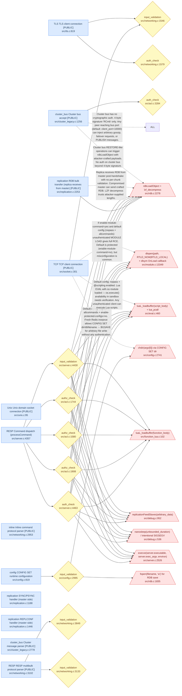

# Security Diagrams

_Generated 2026-04-27 05:18 UTC_

## Context Map, Entry Points, Trust Boundaries, Sinks

_Source: `context-map.json`_

```mermaid
flowchart LR

    %% Entry Points
    EP-001["TCP TCP client connection [PUBLIC]\nsrc/socket.c:301"]
    EP-002["TLS TLS client connection [PUBLIC]\nsrc/tls.c:819"]
    EP-003["Unix Unix domain socket connection [PUBLIC]\nsrc/unix.c:95"]
    EP-004["RESP RESP multibulk protocol parser [PUBLIC]\nsrc/networking.c:3102"]
    EP-005["inline Inline command protocol parser [PUBLIC]\nsrc/networking.c:2953"]
    EP-006["RESP Command dispatch (processCommand)\nsrc/server.c:4357"]
    EP-007["replication SYNC/PSYNC handler (master side)\nsrc/replication.c:1188"]
    EP-008["replication REPLCONF handler (master side)\nsrc/replication.c:1446"]
    EP-009["replication RDB bulk transfer (replica receives from master) [PUBLIC]\nsrc/replication.c:2253"]
    EP-010["cluster_bus Cluster bus accept [PUBLIC]\nsrc/cluster_legacy.c:1256"]
    EP-011["cluster_bus Cluster message parser [PUBLIC]\nsrc/cluster_legacy.c:2778"]
    EP-012["config CONFIG SET runtime configuration\nsrc/config.c:819"]

    %% Trust Boundaries
    TB-001{"input_validation\nsrc/networking.c:1546"}
    TB-002{"auth_check\nsrc/server.c:4463"}
    TB-003{"authz_check\nsrc/acl.c:1908"}
    TB-004{"authz_check\nsrc/acl.c:1580"}
    TB-005{"authz_check\nsrc/acl.c:1744"}
    TB-006{"input_validation\nsrc/config.c:2995"}
    TB-007{"input_validation\nsrc/server.c:4430"}
    TB-008{"auth_check\nsrc/networking.c:1579"}
    TB-009{"auth_check\nsrc/acl.c:3284"}
    TB-010{"input_validation\nsrc/networking.c:3849"}
    TB-011{"input_validation\nsrc/networking.c:3133"}

    %% Sinks
    SINK-001[/"dlopen(path, RTLD_NOW|RTLD_LOCAL) + dlsym OnLoad callback\nsrc/module.c:13349"\]
    SINK-002[/"luaL_loadbuffer(script_body) + lua_pcall\nsrc/eval.c:460"\]
    SINK-003[/"luaL_loadbuffer(function_body)\nsrc/function_lua.c:102"\]
    SINK-004[/"chdir(argv[0]) via CONFIG SET dir\nsrc/config.c:2741"\]
    SINK-005[/"fopen(filename, 'w') for RDB save\nsrc/rdb.c:1835"\]
    SINK-006[/"rdbLoadObject + lzf_decompress\nsrc/rdb.c:2278"\]
    SINK-007[/"replicationFeedSlaves(arbitrary_data)\nsrc/debug.c:952"\]
    SINK-008[/"nanosleep(unbounded_duration) / intentional SIGSEGV\nsrc/debug.c:536"\]
    SINK-009[/"execve(server.executable, server.exec_argv, environ)\nsrc/server.c:2526"\]

    %% Flows
    EP-001 --> TB-001
    EP-002 --> TB-001
    EP-006 --> TB-002
    EP-006 --> TB-003
    EP-006 --> TB-004
    EP-006 --> TB-005
    EP-012 --> TB-006
    EP-006 --> TB-007
    EP-002 --> TB-008
    EP-010 --> TB-009
    EP-004 --> TB-010
    EP-004 --> TB-011
    TB-002 --> SINK-001
    TB-003 --> SINK-001
    TB-004 --> SINK-001
    TB-005 --> SINK-001
    TB-007 --> SINK-001
    TB-002 --> SINK-002
    TB-003 --> SINK-002
    TB-004 --> SINK-002
    TB-005 --> SINK-002
    TB-007 --> SINK-002
    TB-002 --> SINK-003
    TB-003 --> SINK-003
    TB-004 --> SINK-003
    TB-005 --> SINK-003
    TB-007 --> SINK-003
    TB-006 --> SINK-004
    TB-006 --> SINK-005
    EP-009 --> SINK-006
    TB-002 --> SINK-006
    TB-003 --> SINK-006
    TB-004 --> SINK-006
    TB-005 --> SINK-006
    TB-007 --> SINK-006
    TB-002 --> SINK-007
    TB-003 --> SINK-007
    TB-004 --> SINK-007
    TB-005 --> SINK-007
    TB-007 --> SINK-007
    TB-002 --> SINK-008
    TB-003 --> SINK-008
    TB-004 --> SINK-008
    TB-005 --> SINK-008
    TB-007 --> SINK-008
    TB-002 --> SINK-009
    TB-003 --> SINK-009
    TB-004 --> SINK-009
    TB-005 --> SINK-009
    TB-007 --> SINK-009

    %% Unchecked Flows (no trust boundary)
    EP-010 -. "Cluster bus has no cryptographic auth. 4-byte signature 'RCmb' only. Any peer reaching bus port (default: client_port+10000) can inject arbitrary gossip, failover requests, or PUBLISH messages." .-> ALL
    EP-001 -. "Default config: nopass + allcommands + enable-protected-configs=no. Fresh Redis instance allows CONFIG SET dir/dbfilename → BGSAVE for arbitrary file write without any authentication." .-> SINK-004
    EP-001 -. "Default config: nopass + @scripting enabled. Lua EVAL with os module loaded — os.execute() availability in sandbox needs verification. Any unauthenticated client can execute Lua scripts." .-> SINK-002
    EP-009 -. "Replica receives RDB from master post-handshake with no per-chunk validation. Compromised master can send crafted RDB. LZF decompress trusts attacker-supplied lengths." .-> SINK-006
    EP-001 -. "If enable-module-command=yes and default config (nopass + allcommands): unauthenticated MODULE LOAD gives full RCE. Default is protected (enable-module-command=no), but misconfiguration is common." .-> SINK-001
    EP-010 -. "Cluster bus RESTORE-like operations can trigger rdbLoadObject with attacker-crafted payloads. No auth on cluster bus beyond 4-byte signature." .-> SINK-006

    classDef ep fill:#dbeafe,stroke:#3b82f6,color:#1e3a5f
    classDef tb fill:#fef9c3,stroke:#ca8a04,color:#713f12
    classDef sink fill:#fee2e2,stroke:#dc2626,color:#7f1d1d
    class EP-001,EP-002,EP-003,EP-004,EP-005,EP-006,EP-007,EP-008,EP-009,EP-010,EP-011,EP-012 ep
    class TB-001,TB-002,TB-003,TB-004,TB-005,TB-006,TB-007,TB-008,TB-009,TB-010,TB-011 tb
    class SINK-001,SINK-002,SINK-003,SINK-004,SINK-005,SINK-006,SINK-007,SINK-008,SINK-009 sink
```
