# Security Diagrams

_Generated 2026-04-27 10:03 UTC_

## Findings Summary

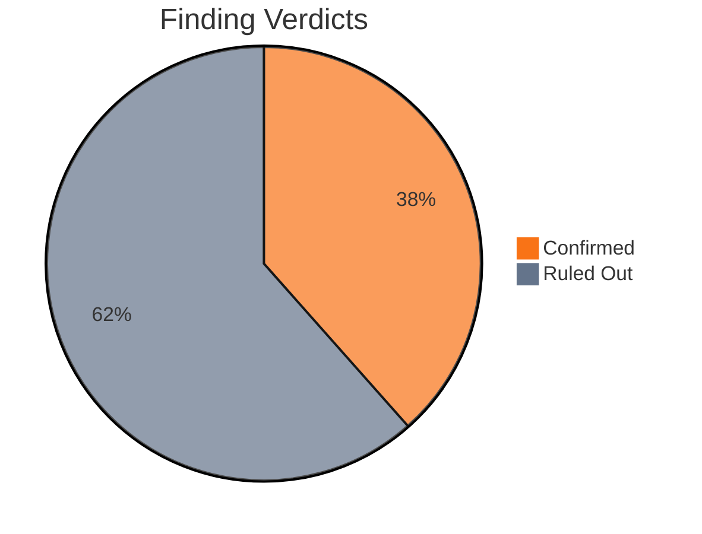

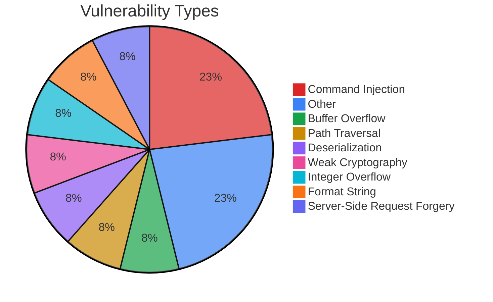

## Attack Surface (Stage B)

_Source: `attack-surface.json`_

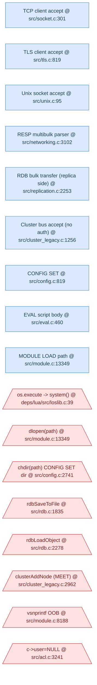

## Attack Tree

_Source: `attack-tree.json`_ _(enriched with proximity scores and disproven reasons)_

```mermaid
flowchart TD
    ROOT{"Compromise Redis server or infrastructure\nMultiple attack vectors\n[exploring]"}
    subgraph N1 ["Achieve RCE on Redis server"]
        N1["Achieve RCE on Redis server\nLua sandbox escape, MODULE LOAD, or write-anywhere\n[confirmed]"]
        N1a["RCE via Lua os.execute (FIND-003)\nEVAL 'os.execute(cmd)' — os.execute loaded in sandbox, readonly only blocks table writes not function calls\n[confirmed]"]
        N1b["RCE via MODULE LOAD (FIND-004)\nMODULE LOAD /path/to/malicious.so — dlopen with no path sanitization\n[confirmed]"]
        N1c["Arbitrary file write via CONFIG SET dir (FIND-002)\nCONFIG SET dir /target + CONFIG SET dbfilename name + BGSAVE — write RDB to any writable path\n[confirmed]"]
    end
    subgraph N2 ["Compromise cluster integrity"]
        N2["Compromise cluster integrity\nCluster bus injection or ACL bypass\n[confirmed]"]
        N2a["Inject into cluster via unauthenticated bus (FIND-005)\nSend MEET/PUBLISH/FAILOVER messages to cluster bus port — 4-byte magic only, no crypto auth\n[confirmed]"]
        N2b["Full ACL bypass via cluster secret sniffing (FIND-007)\nSniff cluster bus PING extensions for secret, AUTH as 'internal connection' on client port — c-&gt;user=NULL bypasses all ACL\n[confirmed]"]
        N1["Achieve RCE on Redis server\nLua sandbox escape, MODULE LOAD, or write-anywhere\n[confirmed]"]
        N1a["RCE via Lua os.execute (FIND-003)\nEVAL 'os.execute(cmd)' — os.execute loaded in sandbox, readonly only blocks table writes not function calls\n[confirmed]"]
        N1b["RCE via MODULE LOAD (FIND-004)\nMODULE LOAD /path/to/malicious.so — dlopen with no path sanitization\n[confirmed]"]
        N1c["Arbitrary file write via CONFIG SET dir (FIND-002)\nCONFIG SET dir /target + CONFIG SET dbfilename name + BGSAVE — write RDB to any writable path\n[confirmed]"]
    end
    subgraph N3 ["Compromise replication integrity"]
        N3{"Compromise replication integrity\nMITM on replication stream\n[exploring]"}
        N3a{"Inject crafted RDB via replication MITM (FIND-006)\nForge FULLRESYNC with malicious RDB — no auth, no TLS, no integrity check by default\n[exploring]"}
    end
    subgraph N4 ["Compromise CI/CD pipeline"]
        N4["Compromise CI/CD pipeline\nGitHub Actions workflow injection\n[confirmed]"]
        N4a["Shell injection via test_args (FIND-008)\nworkflow_dispatch with shell metacharacters in test_args — direct interpolation into run: blocks\n[confirmed]"]
        N4b["GITHUB_ENV injection via use_repo (FIND-009)\nNewline injection in use_repo → env poisoning → attacker-controlled checkout\n[confirmed]"]
    end
    ROOT --> N1
    ROOT --> N2
    ROOT --> N3
    ROOT --> N4

    %% Edges
    ROOT --> N1
    ROOT --> N2
    ROOT --> N3
    ROOT --> N4
    N1 --> N1a
    N1 --> N1b
    N1 --> N1c
    N2 --> N2a
    N2 --> N2b
    N2b --> N1
    N3 --> N3a
    N4 --> N4a
    N4 --> N4b

    classDef confirmed fill:#dcfce7,stroke:#16a34a,color:#14532d
    classDef disproven fill:#f1f5f9,stroke:#94a3b8,color:#64748b
    classDef exploring fill:#fef9c3,stroke:#ca8a04,color:#713f12
    classDef uncertain fill:#fef3c7,stroke:#d97706,color:#78350f
    classDef unexplored fill:#f8fafc,stroke:#cbd5e1,color:#334155
    class ROOT,N3,N3a exploring
    class N1,N1a,N1b,N1c,N2,N2a,N2b,N4,N4a,N4b,N5 confirmed
    style ROOT stroke-width:3px
```

## Hypotheses,Evidence Chain

_Source: `hypotheses.json`_

```mermaid
flowchart TD
    subgraph FIND_001 ["FIND-001"]
        HN1["H1 → FIND-001 [confirmed]\nA loaded Redis module with name &gt; 1019 chars causes vsnprintf OO..."]
        PN2["H1-P1 [confirmed]\nsnprintf(msg, sizeof(msg), '&lt;%s&gt; ', module-&gt;name) with nam...\nConfirmed by code reading: snprintf returns would-be length when tr..."]
        PN3["H1-P2 [confirmed]\nsizeof(msg) - name_len underflows to SIZE_MAX-range value since bot...\nConfirmed: sizeof(msg)=1024, name_len &gt; 1024, subtraction wraps ..."]
        PN4["H1-P3 [confirmed]\nReachability requires MODULE LOAD (enable-module-command != no) and...\nConfirmed: module-&gt;name set from name argument to RM_Init at mod..."]
    end
    subgraph FIND_002 ["FIND-002"]
        HN5["H2 → FIND-002 [confirmed]\nCONFIG SET dir /tmp + CONFIG SET dbfilename shell.php + BGSAVE writ..."]
        PN6["H2-P1 [confirmed]\nCONFIG SET dir calls chdir() at config.c:2741 with no path sanitiza...\nConfirmed: chdir(argv[0]) at config.c:2741. No validation of path."]
        PN7["H2-P2 [confirmed]\ndir and dbfilename are PROTECTED_CONFIG, gated by enable-protected-...\nConfirmed: config.c:3327 sets PROTECTED_CONFIG for dir. config.c:31..."]
        PN8["H2-P3 [confirmed]\nWhen enable-protected-configs is 'yes' or 'local', any authenticate...\nConfirmed: well-documented Redis exploitation technique. RDB file c..."]
    end
    subgraph FIND_003 ["FIND-003"]
        HN9["H3 → FIND-003 [confirmed]\nEVAL 'return os.execute('id')' 0 executes shell commands via system..."]
        PN10["H3-P1 [confirmed]\nluaopen_os at script_lua.c:1233 loads the full os library including...\nConfirmed: luaopen_os loads all os functions. loslib.c os_execute c..."]
        PN11["H3-P2 [confirmed]\nThe readonly flag (lua_enablereadonlytable at lapi.c:1099) only pre...\nConfirmed: lvm.c:141 checks h-&gt;readonly only in the settable pat..."]
        PN12["H3-P3 [confirmed]\nNo code explicitly removes os.execute, os.exit, os.remove, or os.re...\nSearched eval.c and script_lua.c thoroughly. No lua_pushnil/lua_set..."]
        PN13["H3-P4 [confirmed]\nEVAL requires @scripting ACL category (not @admin), so any authenti...\nConfirmed from command JSON specs: EVAL is ACL_CATEGORY_SCRIPTING, ..."]
    end
    subgraph FIND_004 ["FIND-004"]
        HN14["H4 → FIND-004 [confirmed]\nMODULE LOAD passes the path argument directly to dlopen() with no s..."]
        PN15["H4-P1 [confirmed]\nmoduleLoad at module.c:13349 calls dlopen(path, RTLD_NOW|RTLD_LOCAL...\nConfirmed: path goes directly to dlopen. Only check is stat() for e..."]
        PN16["H4-P2 [confirmed]\nenable-module-command defaults to PROTECTED_ACTION_ALLOWED_NO, bloc...\nConfirmed: config.c:3199 sets default to PROTECTED_ACTION_ALLOWED_N..."]
    end
    subgraph FIND_005 ["FIND-005"]
        HN17["H5 → FIND-005 [confirmed]\nAn attacker on the network can inject MEET messages to the cluster ..."]
        PN18["H5-P1 [confirmed]\nThe cluster bus validates messages with only a 4-byte magic 'RCmb' ...\nConfirmed: cluster_legacy.c:3478 memcmp(hdr-&gt;sig,'RCmb',4) and v..."]
        PN19["H5-P2 [confirmed]\nA MEET message from an unknown sender creates a new node entry unco...\nConfirmed: CLUSTERMSG_TYPE_MEET from unknown sender triggers cluste..."]
        PN20["H5-P3 [confirmed]\nPUBLISH messages can be injected to push arbitrary pub/sub messages...\nConfirmed: PUBLISH processed at line 3260 with only sender-known ch..."]
    end
    subgraph FIND_006 ["FIND-006"]
        HN21["H6 → FIND-006 [confirmed]\nA MITM on the replication link can inject crafted RDB data that the..."]
        PN22["H6-P1 [confirmed]\nmasterauth defaults to NULL — replica does not send AUTH to master ...\nConfirmed: config.c:3184 EMPTY_STRING_IS_NULL for masterauth. repli..."]
        PN23["H6-P2 [confirmed]\nWithout TLS, the replication stream is plaintext TCP with no integr...\nConfirmed: no signature, no MAC, no integrity check on the replicat..."]
        PN24["H6-P3 [confirmed]\nThe RDB data is loaded via rdbLoadRioWithLoadingCtx at replication....\nConfirmed: replication.c:2518 calls rdbLoadRioWithLoadingCtx direct..."]
    end
    subgraph FIND_007 ["FIND-007"]
        HN25["H7 → FIND-007 [confirmed]\nAn attacker who can sniff cluster bus traffic (no TLS) can extract ..."]
        PN26["H7-P1 [confirmed]\nThe cluster secret (40 hex chars from /dev/urandom) is included in ...\nConfirmed: cluster secret sent in PING extensions. 40 hex chars = 1..."]
        PN27["H7-P2 [confirmed]\nAUTH 'internal connection' &lt;secret&gt; on the client port sets c...\nConfirmed: acl.c:3287 checks username == 'internal connection', lin..."]
        PN28["H7-P3 [confirmed]\nThe internal auth path is accessible from any client port connectio...\nConfirmed: authCommand at acl.c:3284 processes the 'internal connec..."]
    end
    subgraph FIND_008 ["FIND-008"]
        HN29["H8 → FIND-008 [confirmed]\nA user with repo write access can inject shell commands into CI run..."]
        PN30["H8-P1 [confirmed]\ntest_args input is interpolated directly into run: commands as $((g...\nConfirmed: daily.yml uses direct $(( )) interpolation in run: block..."]
        PN31["H8-P2 [confirmed]\nExploitation requires write access to dispatch workflow_dispatch — ...\nConfirmed: no pull_request_target trigger exists. Only workflow_dis..."]
    end
    subgraph FIND_009 ["FIND-009"]
        HN32["H9 → FIND-009 [confirmed]\nGITHUB_ENV injection via newline in use_repo workflow_dispatch inpu..."]
        PN33["H9-P1 [confirmed]\necho 'GITHUB_REPOSITORY=$((github.event.inputs.use_repo))' &gt;&gt;...\nConfirmed: daily.yml line 44 uses echo &gt;&gt; GITHUB_ENV with uns..."]
        PN34["H9-P2 [confirmed]\nThe poisoned GITHUB_REPOSITORY feeds into actions/checkout reposito...\nConfirmed: checkout at line 50-53 uses env.GITHUB_REPOSITORY and en..."]
    end
    subgraph FIND_010 ["FIND-010"]
        HN35["H10 → FIND-010 [confirmed]\nSHA1 usage in Ruby utility scripts is a weak crypto finding but not..."]
        PN36["H10-P1 [confirmed]\nSHA1 is used for dataset consistency checking (rolling hash of key+...\nConfirmed: redis-sha1.rb chains Digest::SHA1.hexdigest(sha1+k) for ..."]
        PN37["H10-P2 [confirmed]\nSHA1 collision attack cannot forge matching rolling checksums for d...\nConfirmed: the chaining (hash(previous_hash + key)) means a collisi..."]
    end

    %% Prediction edges
    HN1 --> PN2
    HN1 --> PN3
    HN1 --> PN4
    HN5 --> PN6
    HN5 --> PN7
    HN5 --> PN8
    HN9 --> PN10
    HN9 --> PN11
    HN9 --> PN12
    HN9 --> PN13
    HN14 --> PN15
    HN14 --> PN16
    HN17 --> PN18
    HN17 --> PN19
    HN17 --> PN20
    HN21 --> PN22
    HN21 --> PN23
    HN21 --> PN24
    HN25 --> PN26
    HN25 --> PN27
    HN25 --> PN28
    HN29 --> PN30
    HN29 --> PN31
    HN32 --> PN33
    HN32 --> PN34
    HN35 --> PN36
    HN35 --> PN37

    classDef confirmed fill:#dcfce7,stroke:#16a34a,color:#14532d
    classDef disproven fill:#f1f5f9,stroke:#94a3b8,color:#64748b
    classDef testing fill:#fef9c3,stroke:#ca8a04,color:#713f12
    classDef pred_confirmed fill:#bbf7d0,stroke:#16a34a,color:#14532d
    classDef pred_disproven fill:#e2e8f0,stroke:#94a3b8,color:#475569
    classDef pred_testing fill:#fefce8,stroke:#ca8a04,color:#713f12
    class HN1,HN5,HN9,HN14,HN17,HN21,HN25,HN29,HN32,HN35 confirmed
    class PN2,PN3,PN4,PN6,PN7,PN8,PN10,PN11,PN12,PN13,PN15,PN16,PN18,PN19,PN20,PN22,PN23,PN24,PN26,PN27,PN28,PN30,PN31,PN33,PN34,PN36,PN37 pred_confirmed
```

## Attack Paths

_Source: `attack-paths.json`_

#### AP-001: moduleLogRaw stack buffer overflow via long module name (Proximity 4/10, confirmed)

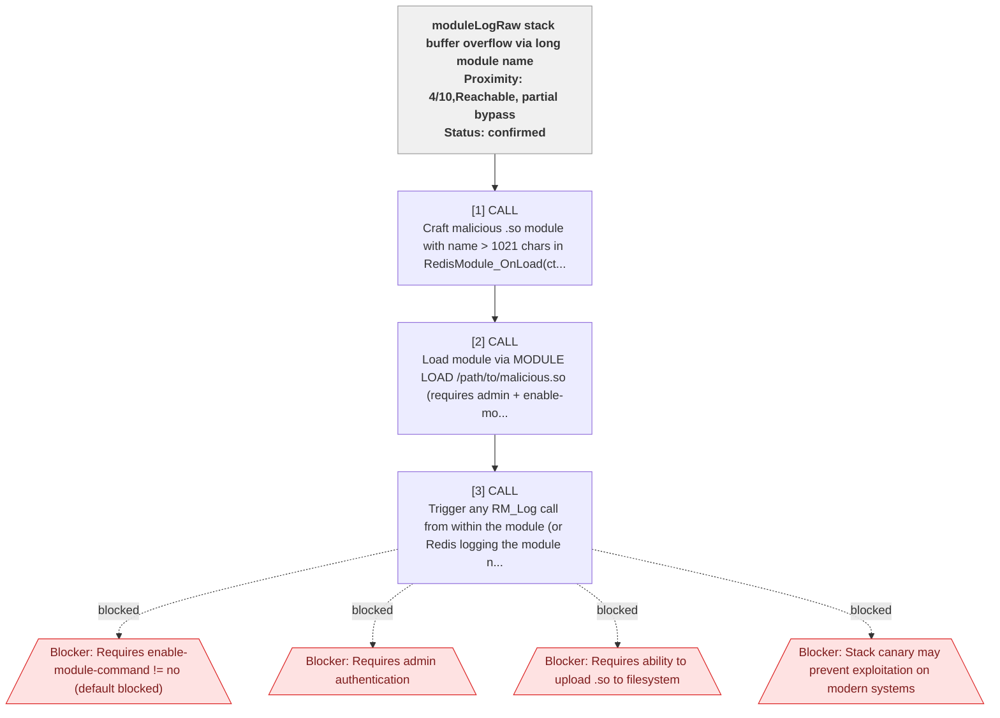

#### AP-002: CONFIG SET dir + BGSAVE write-anywhere to filesystem (Proximity 3/10, confirmed)

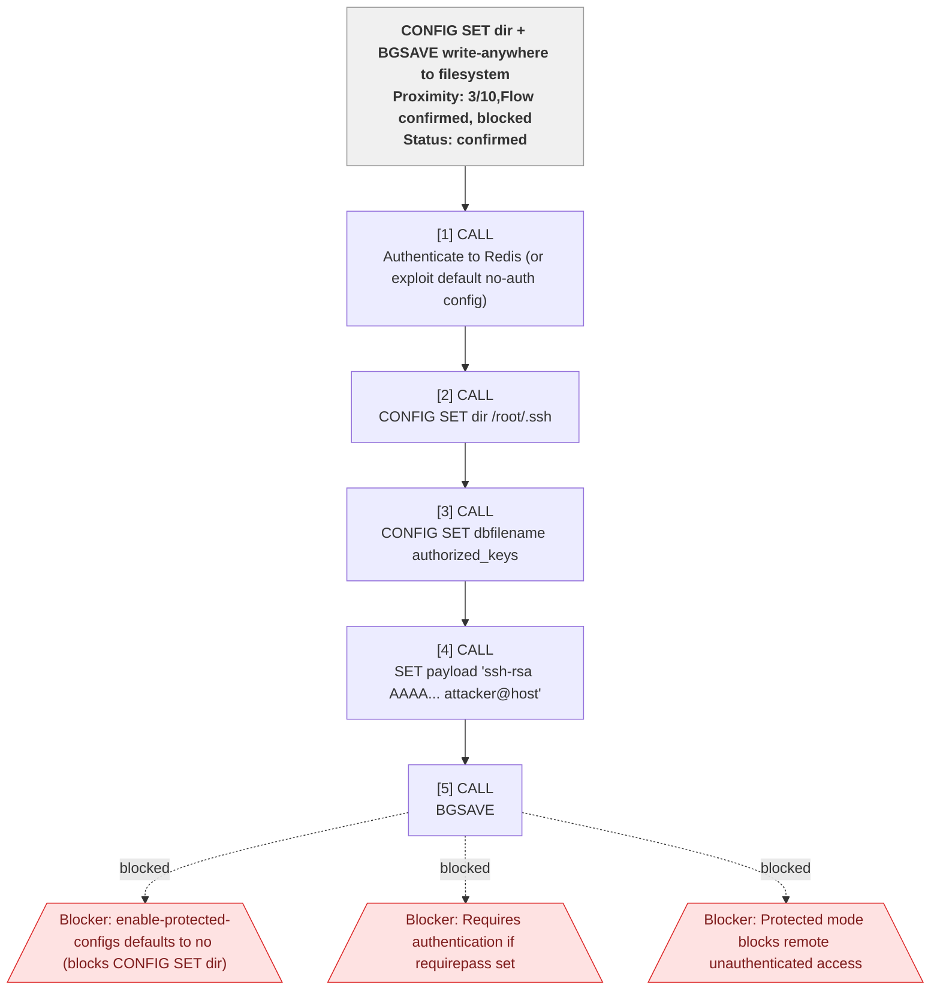

#### AP-003: Lua sandbox escape via os.execute for RCE (Proximity 7/10, confirmed)

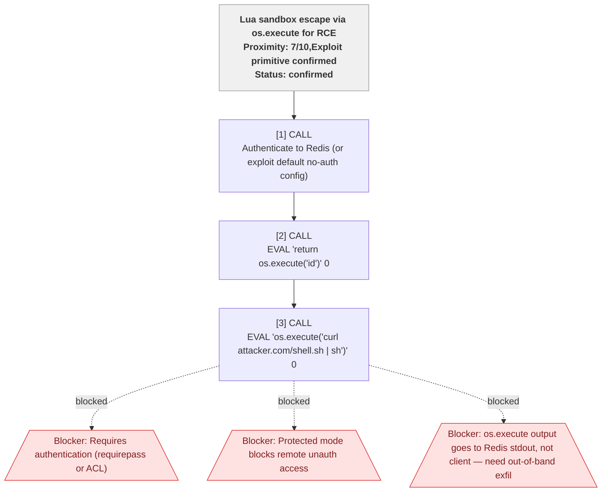

#### AP-004: MODULE LOAD arbitrary .so for RCE (Proximity 3/10, confirmed)

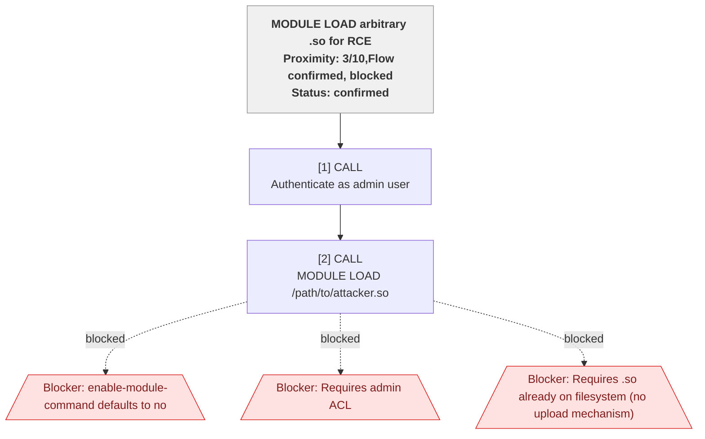

#### AP-005: Cluster bus MEET injection to join cluster (Proximity 8/10, confirmed)

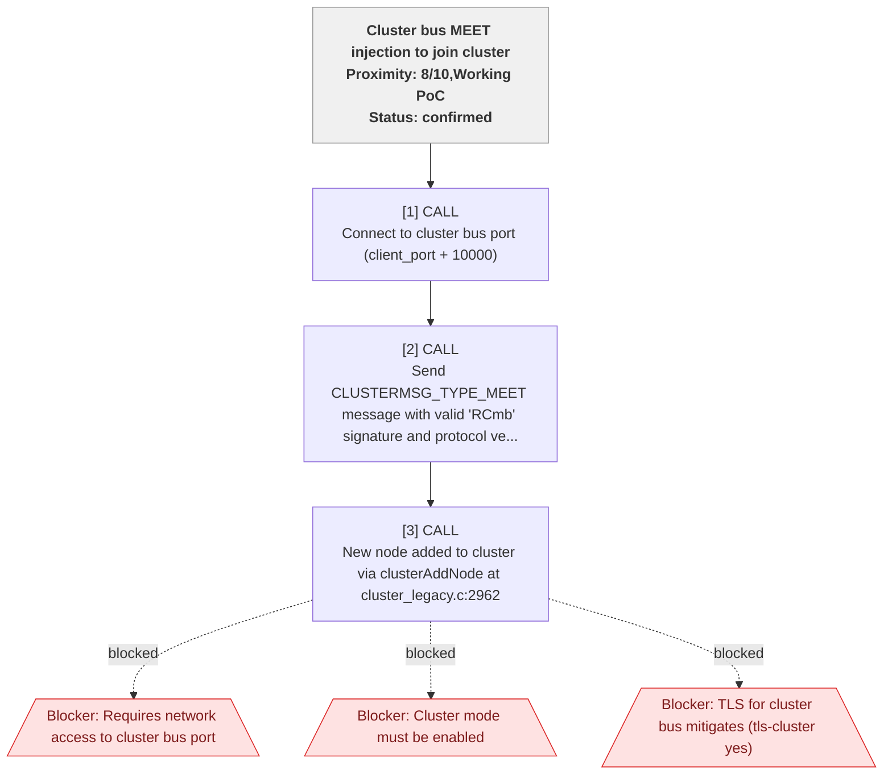

#### AP-006: Replication MITM for RDB injection (Proximity 5/10, uncertain)

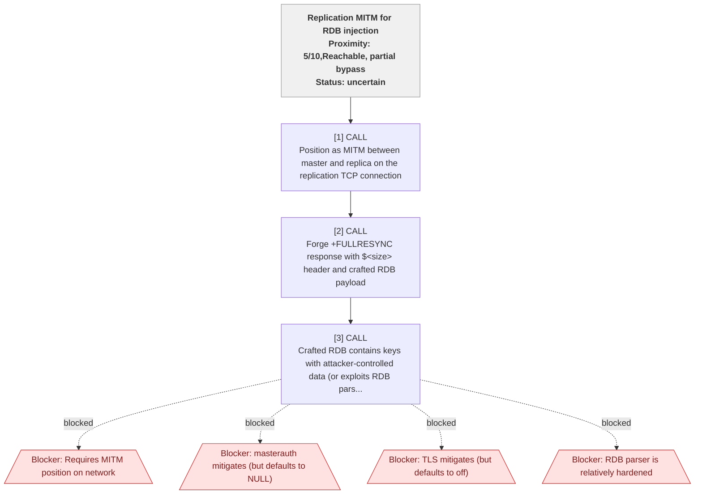

#### AP-007: Cluster secret sniffing to ACL bypass via internal auth (Proximity 6/10, confirmed)

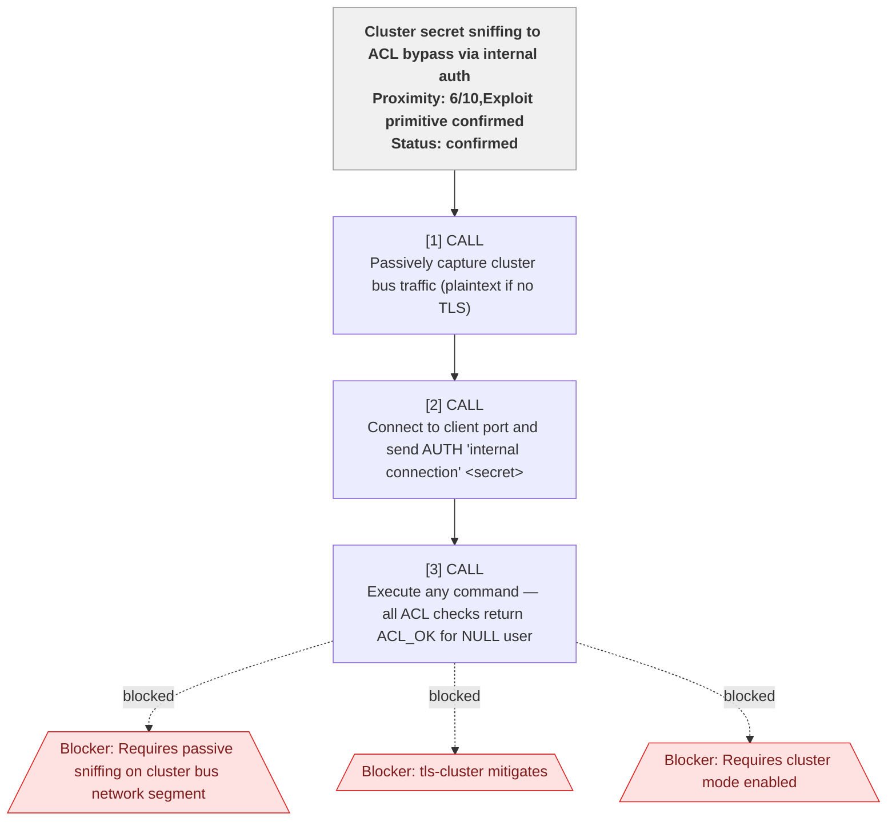

#### AP-008: GitHub Actions shell injection via workflow_dispatch test_args (Proximity 7/10, confirmed)

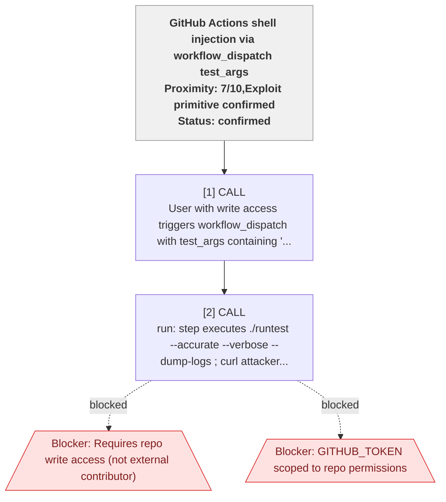

#### AP-009: GITHUB_ENV injection via use_repo for attacker-controlled checkout (Proximity 7/10, confirmed)

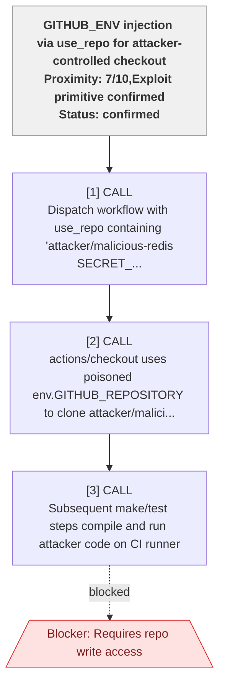

#### AP-010: SHA1 weak crypto in utility scripts (Proximity 0/10, blocked)

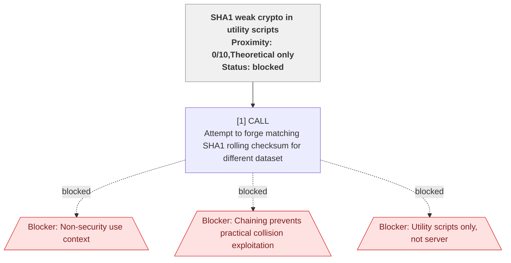

